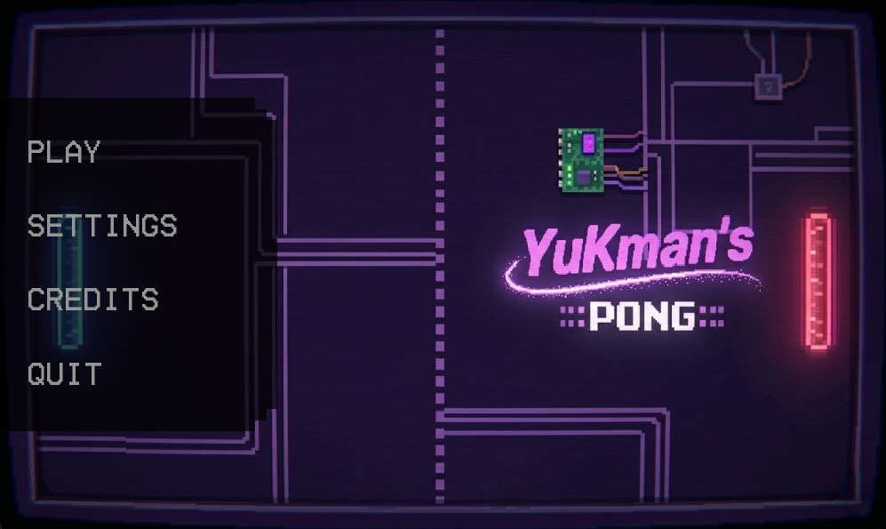
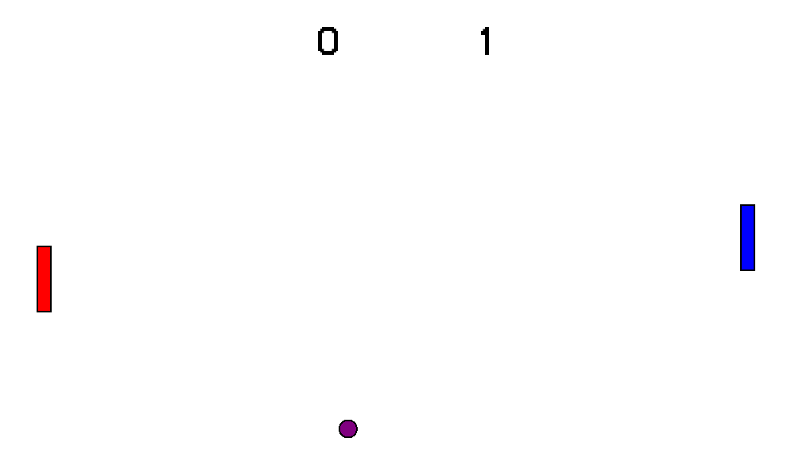
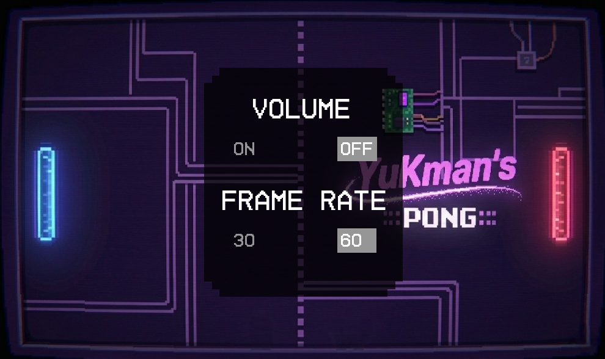
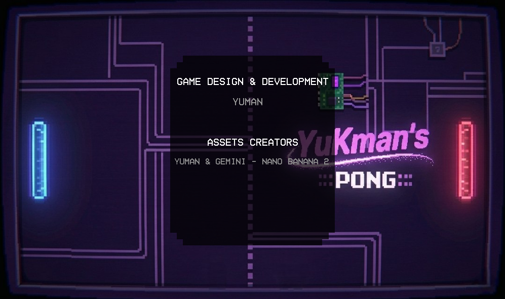

# YuKman's Pong 🎮

A classic Pong game built from scratch using C++ and SFML 3, featuring a menu system, basic game settings, credits, and two-player local gameplay.

This project is my very first SFML game, created after only three weeks of learning SFML.  
At college, I am currently studying only the fundamentals of C++, so this game represents my first step into graphics, game loops, and interactive programming.

PS: The game does not include any sound yet, as I haven’t learned how to implement audio in SFML. This will be added in my future small projects as I continue learning.

---

## 📸 Screenshots

### Main Menu


### Gameplay


### Settings


### Credits


---

## 🎮 Gameplay

- Two-player local multiplayer — play against a friend on the same keyboard
- Ball physics — random angle and direction on each serve
- Score tracking — first to score wins
- Pause menu — accessible during gameplay via Escape

---

## 🕹️ Controls

| Action         | Player 1 | Player 2     |
|----------------|----------|--------------|
| Move Up        | `W`      | `↑`          |
| Move Down      | `S`      | `↓`          |
| Pause / Back   | `Escape` | `Escape`     |

---

## ⚙️ Features

- Main Menu with Play, Settings, Credits, and Quit
- Settings Menu — toggle Volume On/Off and set FPS (30 or 60)
- Credits Screen — game design, development, and asset credits
- Quit Confirmation — confirm or deny before exiting
- Hover Effects on all buttons
- Delta Time movement — consistent speed across all hardware

---

## 🛠️ Built With

- C++20
- SFML 3.0.2 — graphics, windowing, and input
- Visual Studio 2026 Community

---

## 📁 Project Structure

```
YuKman's Pong/
├── main.cpp              # Entry point, game loop, window management
├── menu.cpp              # Main menu rendering and mouse interaction
├── player.cpp            # Player creation and controls
├── ball.cpp              # Ball creation and movement physics
├── settings.cpp          # Settings menu rendering and interaction
├── credits.cpp           # Credits screen rendering
├── closing.cpp           # Quit confirmation and closing logic
├── score_updater.cpp     # Score hitboxes and score display
├── prototypes.h          # All structs, enums, and function prototypes
└── README.md
```

---

## 🚀 How to Build

### Requirements
- Visual Studio 2022/2026 with Desktop development with C++
- SFML 3.0.2 for Visual C++

### Setup

1. Clone the repository:
```bash
git clone https://github.com/YumanKh/YuKman-s-pong.git
```

2. Download [SFML 3.0.2](https://www.sfml-dev.org/download.php) for Visual C++ 64-bit

3. In Visual Studio, open Project Properties:
   - VC++ Directories → Include Directories: add `path/to/SFML/include`
   - VC++ Directories → Library Directories: add `path/to/SFML/lib`
   - Linker → Input → Additional Dependencies: add:
     ```
     sfml-graphics-d.lib
     sfml-window-d.lib
     sfml-system-d.lib
     ```

4. Copy all `.dll` files from `SFML/bin/` into your project output directory

5. Copy the following asset files into the same directory as your `.exe`:
   - `BlackGameFont.ttf`
   - `MenuWallpaper2.jpg`
   - `MenuSprite.png`
   - `MenuQuitSprite.png`

6. Build with Ctrl+Shift+B and run with Ctrl+F5

---

## 👤 Author

**Yuman Khoufache**  
First-year Computer Science student at Austin Community College  
Building towards a career as a C++ Systems Engineer

---

## 🙏 Special Thanks

- **Claude (Anthropic)** — The AI who teached me everything I know about SFML and helped me debug my code
- **SFML Team** — for the library
- **Gemini / Nano Banana 2** — asset creation (menu wallpaper)

---

## 📜 License

© 2026 Yuman — This project is released with no copyright.  
You are free to use, modify, and share it without restriction.
